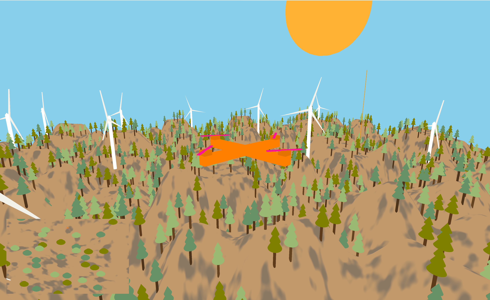

# OpenGL Games in C++ 🎮

This repository contains two exciting games implemented using **OpenGL** and **C++**:

## 1. **TankWars** 🛡️
**TankWars** is a 2D dual-player tank battle game where two players control tanks and battle in an arena. The goal is to destroy the opponent's tank while avoiding damage. It's fast-paced and full of strategy!

  
*This is the intense game scene for the TankWars battle. Who will destroy the other’s tank first?*

## 2. **Drone Minigame** 🚁
**Drone Minigame** is a 3D game where the player pilots a drone to pick up packets from one location and deliver them to another. Navigate through the air, dodge obstacles, and complete the mission to win.

  
*This is the flight scene of Drone Minigame. Can you make the perfect delivery while avoiding obstacles in the air?*

## 🛠️ Technologies Used
- **C++**
- **OpenGL**

Enjoy the games, and may the best player win! ✨
